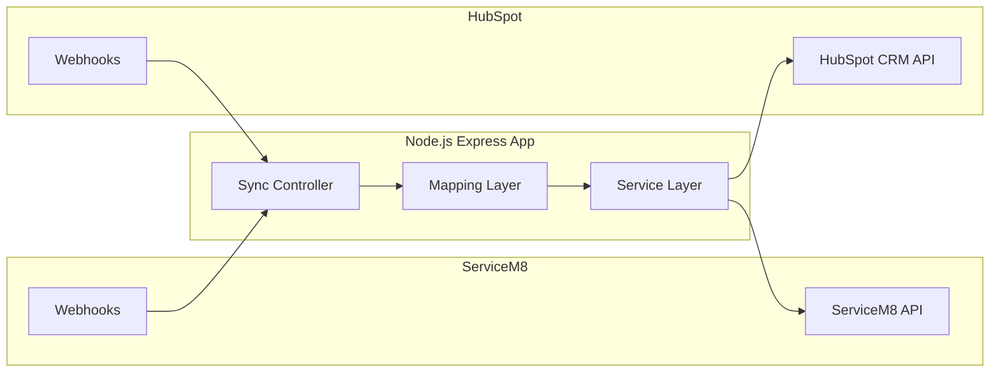

# 🏗 System Design: ServiceM8 ↔ HubSpot Integration

**Author:** Mohammad Saddam  
**Project:** Enterprise Integration Middleware  
**Status:** Active Development / v1.0.0  

---

## 1. System Overview

The **ServiceM8 ↔ HubSpot Middleware** is a specialized Node.js application designed to orchestrate data flow between field operations (**ServiceM8**) and customer relationship management (**HubSpot**).

It acts as a **stateless translation layer**, ensuring:

- Data created in the field is reflected in the CRM.
- CRM updates propagate back to operations.
- Duplicate records are prevented.
- Data hygiene is maintained across systems.

---

## 2. High-Level Architecture

The system follows a **Modular Middleware Pattern**, decoupling:

- API communication  
- Business logic  
- Data transformation  

### Architecture Diagram (Mermaid)




3. Core Component Responsibilities
Component	Responsibility
Controllers	Orchestrate sync logic. Decide execution flow when a request arrives.
Mappings	Pure transformation functions converting ServiceM8 JSON → HubSpot format (and vice versa).
Services	Low-level API handlers for GET, POST, PATCH requests including authentication handling.
Webhooks	Entry points receiving event notifications from external platforms.
Utils	Shared utilities: rate limiting, error formatting, global constants (e.g., JOB_CATEGORY_UUID).
4. Key Workflows & Data Flows
A. ServiceM8 → HubSpot (Outbound)

Objective: Capture field activity and update the sales pipeline.

Workflows:

Contacts / Companies

syncServiceM8ClientToHubSpotAsContact

syncServiceM8ClientToHubSpotAsCompany

Deals

syncServiceM8JobToHubSpotAsDeal

Triggered on Job creation/update

Activity

syncServiceM8NoteToHubSpotAsActivity

Syncs job notes to HubSpot timeline

B. HubSpot → ServiceM8 (Inbound)

Objective: Push leads and closed-won deals into operations.

Workflows:

Leads → Clients

syncHubspotContactToServiceM8Client

syncHubspotCompanyToServiceM8Client

Deals → Jobs

syncHubspotDealToServiceM8Job

Selective sync to ensure only qualified deals become active jobs

C. Batch Operations

Used for:

High-volume synchronization

Initial migrations

Backfills

Batch Processors:

processBatchContactInHubspot

processBatchContactInServiceM8

processBatchDealInHubspot

processBatchDealInServiceM8

5. Technical Implementation Details
🛡 Selective Sync Logic

To prevent irrelevant or low-quality data from entering HubSpot:

Job Category Filtering

Validates against JOB_CATEGORY_UUID

Status Mapping

ServiceM8 Status → HubSpot Deal Stage

Quote

Work in Progress

Completed

This ensures pipeline accuracy and prevents CRM pollution.

🔗 Search & Deduplication Strategy

Before creating any record, the middleware performs a lookup.

Primary Keys

Email (Contacts)

Company Name / Domain

Secondary Key

external_id (stores remote system UUID in custom field)

Helper Functions

searchInServiceM8UsingCustomField

findContactInHubspot

This ensures idempotent operations and avoids duplication.

🧪 Error Handling & Resilience
Retries

Automatic retry logic for 5xx errors.

Rate Limiting

Built-in throttling aligned with HubSpot limits:

100 requests / 10 seconds

Logging

Structured logs stored in /logs

Logging libraries:

Winston

Pino

Enables post-mortem debugging and traceability

### 6. Project Directory Structure
```text
├── src/
│   ├── configs/       # API Credentials & Environment Setup
│   ├── controllers/   # Sync Orchestration
│   ├── mappings/      # Data Transformation Logic (Field-to-Field)
│   ├── services/      # Axios-based API Clients
│   ├── utils/         # Helpers & Rate Limiters
│   ├── webhooks/      # Express Routes for Webhook Endpoints
│   └── app.js         # Application Initialization
```


7. Future Roadmap
🔄 Delta Syncing

Scheduled task to detect records updated in the last 24 hours that may have missed a webhook event.

⚖ Conflict Resolution

Implement Last-Modified-Wins logic for advanced two-way synchronization.

📊 Health Dashboard

A lightweight frontend dashboard to:

Monitor sync success rates

Track failed jobs

Retry failed batches

View real-time integration health

Summary

This middleware architecture provides:

Clean separation of concerns

Idempotent, safe synchronization

Resilient retry & rate-limit handling

Scalable batch processing capabilities

It is designed to operate as a reliable enterprise-grade integration layer between field operations and CRM systems.